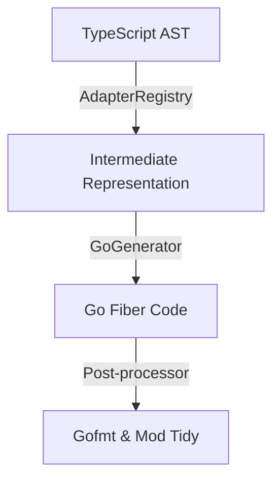

# ts4go: Modular Transpiler (TS -> Go)

**ts4go** is a production-grade modular transpiler designed to convert TypeScript and PHP APIs into high-performance Go code. It uses an Intermediate Representation (IR) architecture to decouple source language analysis from target language generation.

## 🚀 Features

- **Modular Adapter Architecture**: Support for 500+ libraries via plug-and-play adapters.
- **Framework Support**:
  - NestJS (Decorator-based)
  - Express (Functional-style)
  - Vanilla Node.js (Class-based routing)
- **Library Integration**:
  - **Axios**: Automatic conversion to Go `net/http`.
  - **TypeORM**: Conversion of Entities to GORM Structs.
- **Modern Language Features**:
  - **Async/Await**: Captured and mapped to Go's blocking/concurrent execution.
  - **Environment Variables**: `process.env` mapped to `os.Getenv`.
- **Automated Build Pipeline**: Generates code, initializes Go modules, and runs `go mod tidy`.

## 🏗️ Architecture



## 🛠️ Project Structure

- `packages/parser`: TypeScript AST analysis using `ts-morph`.
- `packages/ir`: Agnostic language representation.
- `packages/transformer`: Core transformation logic.
- `packages/adapters`: Pluggable adapters for libraries and frameworks.
- `packages/generator-go`: Handlebars-based Go code generation.
- `packages/cli`: Command-line interface.

## 🏁 Quick Start

1. Install dependencies:
   ```bash
   pnpm install
   ```
2. Build the compiler:
   ```bash
   pnpm build
   ```
3. Compile a TS file to Go:
   ```bash
   npx ts-node packages/cli/src/index.ts build examples/health.controller.ts
   ```

## ⚖️ License

MIT
